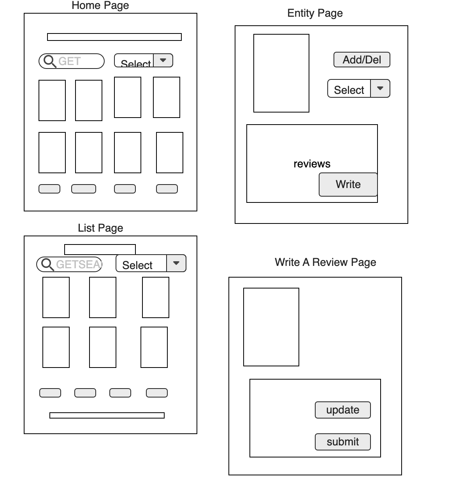

# Design Document - gioia

## 1. Problem Statement

Have you ever asked a friend for a recommendation for a new TV show to watch and they can't come up with anything?
How about it's date night but you and your partner spend 30 minutes trying to decide on a movie?
This new app will save all your recommendations, "wish lists" and reviews!

This app will provide you with a one-stop-shop for your “to read” and “to watch” lists, see reviews,
and keep track of everything you’ve read and watched to help make recommendations to friends.
The best part will be that tv shows and movies will be categorized by the streaming service they are on!
Your home page will be personalized recommendations for you, based on how you rated what you've consumed.


## 2. Top Questions to Resolve in Review

* Will I make this shareable/collaborative?
* Extra Features to add (Caching/Threads/Optionals/Streams)
* Get movie/tv posters
* How to develop a Recommendation Algorithm

## 3. Use Cases

U1. As a user, I want to keep track of my 'wishlist' of books, tv shows and movies.

U2.  As a user, I want to keep track of read/watched books, tv shows and movies.

U3. As a user, I want to be able to provide reviews for everything I’ve read/watched

U4. As a user, I want to see reviews from others when looking for recommendations.

U5. As a user, I want to search for recommendations based on genre/category/length etc

U6. As a user, I want to see tv shows/movies based on the streaming service they are on

U7. As a user, I want to have recommended options populated for me on the home page

U8. As a user, I want to see visuals of the entity when its on my page/list

U9. As a user, I want to edit my user profile.

## 4. Project Scope

4.1. _In Scope_

* Having lists for Users to keep track of what they've read/watched, and want to read/watch
* Allowing Users to access these lists and be able to update them
* Allowing Users to write reviews for their entities
* View other User's Reviews
* Allow Users to search for entities by multiple different avenues (length, genre, streaming service)

_Extensions_
* View other's profiles
* Having Lists be collaborative

4.2. _Out of Scope_

* Updating data of the entities (it should be accurate)
* Ability to Link the entity to where it is located on the internet
* Ability to create new Lists for the Users.

## 5. Proposed Architecture Overview

* I will use API Gateway and Lambda to create my endpoints.
* Data will be stored in DynamoDb.
* There will be a web interface for Users to access their profiles, and lists.
* PlantUML Diagram [here](./class-diagram.puml)
* Sequence Diagram  [here](./CREATE-REVIEW-sequence-diagram.puml) and  [here](./GET-BOOK-sequence-diagram.puml)


## 6. API

6.1 _Public Models_

`BOOKMODEL`
```
String isbn // sort key  
String title
String author 
int yearPublished
int lengthInPages
ENUM genre
List<Review> reviews
String UUID
```

`TVSHOWMODEL`
```
String title // sort key  
List<String> mainActors
int lengthInSeasons
int lengthInMinutes
ENUM genre
ENUM streamingService
List<Review> reviews
String UUID
```

`MOVIEMODEL`
```
String title // sort key  
String director // partition key
List<String> mainActors
int lengthInMinutes
ENUM genre
ENUM streamingService
List<Review> reviews
String UUID
```

`REVIEWMODEL`
```
String userId // sort key  
String review
int rating
String UUIDOfEntity
```

6.2. _Endpoints_

### Get Entity Endpoint
Accepts the Partition Key (and Sort Key) of the entity and returns the corresponding model.
If Not Found, the corresponding NotFoundException will be thrown.

* Accepts `GET` requests to `/book/:isbn`
* Accepts `GET` requests to `/tvshow/:title`
* Accepts `GET` requests to `/movie/:title/director`

### Add Entity To List Endpoint
Accepts a userId and an entity to add the entity to the User's requested List.
If the List or entity is not found, the NotFoundException will be thrown.

* Accepts `POST` requests to `/user/:userId/toread`
* Accepts `POST` requests to `/user/:userId/towatch`
* Accepts `POST` requests to `/user/:userId/read`
* Accepts `POST` requests to `/user/:userId/watched`
* Accepts `POST` requests to `/user/:userId/currentlyReading`
* Accepts `POST` requests to `/user/:userId/currentlyWatching`

### Get Lists' Entities Endpoint
Retrieves all the entities of the User's List
Defaults to an empty list
If not found, NotFoundException is thrown

* Accepts `GET` requests to `/user/:userId/toread`
* Accepts `GET` requests to `/user/:userId/towatch`
* Accepts `GET` requests to `/user/:userId/read`
* Accepts `GET` requests to `/user/:userId/watched`
* Accepts `GET` requests to `/user/:userId/currentlyReading`
* Accepts `GET` requests to `/user/:userId/currentlyWatching`

### Get/Search Entity Endpoint
Accepts criteria to search for an Entity matching the criteria.

* Accepts `GET` requests to `/book/:isbn/search`
* Accepts `GET` requests to `/tvshow/:title/search`
* Accepts `GET` requests to `/movie/:title/director/search`

### Delete Entity From List Endpoint
Removes Entity from the Lists.

* Accepts `DELETE` requests to `/user/:userId/toread`
* Accepts `DELETE` requests to `/user/:userId/towatch`
* Accepts `DELETE` requests to `/user/:userId/currentlyReading`
* Accepts `DELETE` requests to `/user/:userId/currentlyWatching`

### Create a Review Endpoint
Accepts data to create a new Review.

*Accepts `POST` request to `/review`

### Add a Review Endpoint
Accepts an Entity and a Review to add the review to the Entity's reviews List.
If the entity is not found, the NotFoundException will be thrown.

* Accepts `POST` requests to `/book/:isbn/reviews`
* Accepts `POST` requests to  `/tvshow/:title/reviews`
* Accepts `POST` requests to  `/movie/:title/director/reviews`

### Update a User Profile Endpoint
Accepts a User Profile to change
If the user is not found, the UserNotFoundException will be thrown.

* Accepts `PUT` requests to `/user/:email'

## 7. Tables

7.1 `BOOK`
```
String isbn // partition key  
String title
String author 
int yearPublished
int lengthInPages
ENUM genre
List<Review> reviews
String UUID
```
#### GSI: String title // partition key ENUM genre // sort key

7.2 `TVSHOW`
```
String title // partition key  
List<String> mainActors
int lengthInSeasons
int lengthInMinutes
ENUM genre
ENUM streamingService
List<Review> reviews
String UUID
```
#### GSI: ENUM genre // sort key ENUM streaming service // partition

7.3 `MOVIE`
```
String title // parition key  
String director // sort key
List<String> mainActors
int lengthInMinutes
ENUM genre
ENUM streamingService
List<Review> reviews
String UUID
```
#### GSI: ENUM genre // sort key ENUM streaming service // partition

7.4 `REVIEW`
```
String userId // partition key  
String review
int rating
String UUIDOfEntity
```

7.5 `USER`
```
String userId // partition key  
String name
Set<Book> toReadList
Set<Book> currentlyReading
Set<Book> readList
Set<T> toWatchList
Set<T> currentlyWatching
Set<T> watchedList
```

## 7. Pages

MockUps 